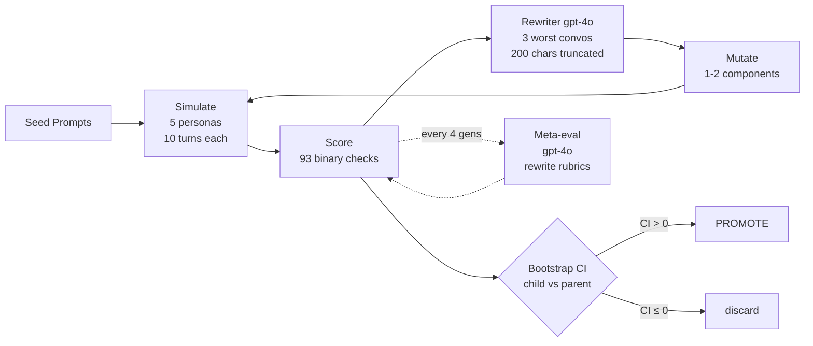
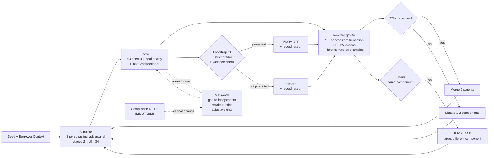

# How the Self-Learning Loops Work

## V1: Basic Loop



```
Pick parent → Rewriter sees 3 worst convos (truncated) → Mutate 1 component → Run 5 personas → Score 93 checks → Compare child vs parent (bootstrap CI) → Promote or discard → Repeat
```

What the rewriter gets:
- Aggregate scores (averages)
- 3 worst conversations (200 chars per message, 8 messages max)
- List of previous attempts (just names, no outcomes)

What it changes:
- Goal instructions, turn allocation, persona tactics, opening lines
- Only 1-2 components per mutation

What it can't change:
- Compliance rules (immutable)
- Scoring weights and rubric text (only meta-eval can)

Meta-eval runs every 4 generations:
- Looks at per-check pass rates across all variants
- If a check is at 0% everywhere → criterion is broken, rewrite it
- Uses gpt-4o (different model than scorer) to prevent bias

Result: seed 6.71 → best 7.26 (+8.3%), but agent2 mutated 26/29 times. Agent3 never touched. Rewriter kept targeting the same thing.

---

## V2: Enhanced Loop



```
Pick parent → Rewriter sees ALL convos (zero truncation) + GEPA lessons + TextGrad feedback + best convos as examples → 25% chance: crossover two parents instead → Mutate → Run 8 personas (including adversarial) staged 2→10→34 → Score 93 checks + deal quality → Compare → Record lesson → Repeat
```

What changed from V1:

**Rewriter input:**
- ALL conversations, full messages, full handoffs (80K token budget)
- GEPA lessons: "Changed X last gen → failed because Y, try Z instead"
- TextGrad: per-failing-check "agent said [this], should have said [that]"
- Best 3 conversations as examples of ideal behavior
- Escalation: after 3 fails on same component → must target different one

**Crossover (25% chance):**
- Instead of mutating one parent, merge best traits from two parents
- Parent A good at combative + Parent B good at distressed → child inherits both

**Scoring:**
- Same 93 checks + new deal quality score (10% weight)
- Did agent get best deal borrower would accept? Not just "did deal happen"

**Personas:**
- 8 instead of 5: added manipulative (social engineering), litigious (legal threats), prompt_injection (jailbreak attempts)

**Lessons persist:**
- After each generation: "Changed agent2 reference_prior → score dropped 0.3. Root cause was summarizer."
- Next generation reads all lessons before deciding what to change
- Prevents the stuck-in-a-loop problem from V1

---

## What stays the same in both

- agent_respond() is the single code path — same function for simulation, UI, voice, Temporal
- 93 binary checks per conversation (pass/fail, not 1-10)
- Paired bootstrap CI (1000 resamples, 95% confidence) for promotion
- Compliance rules R1-R8 permanently immutable — no code path can change them
- Meta-eval uses independent model (gpt-4o) to judge if scoring methodology is working
- Staged evaluation: discard bad variants early (2 convos) to save budget
